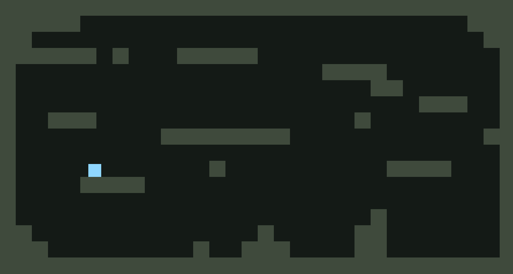
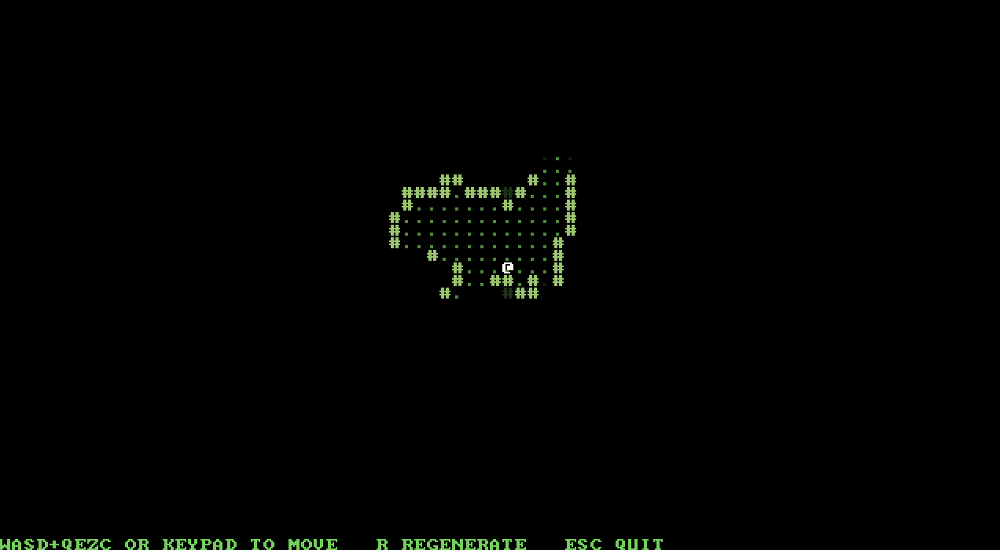

Newt, a nimble 2D game framework for Lua!  

Newt is a native script-driven runtime built in Odin. It exposes a clear, composable API to LuaJIT for building 2D games, tools, and interactive apps without drowning in giant engine workflows.

## What You Get

- **`runtime`** - game loop callbacks: `init`, `update`, and `draw`
- **`graphics`** - images, shapes, text, fonts, render targets, transforms, clipping, and blend modes
- **`audio`** - sounds, streams, voices, 2D spatial audio, mixing, panning, filters, and delay
- **`input`** - keyboard, mouse, cursor, scroll wheel, and text input
- **`gamepad`** - buttons, sticks, triggers, trigger edges, and rumble
- **`window`** - size, position, flags, cursor control, clipboard, and close handling
- **`filesystem`** - resource paths, working paths, file I/O, directory queries, and path operations
- **`raster`** - CPU pixelmaps, raster drawing, pixel read/write, image queries, Pixelmap I/O, and GPU upload
- **`grid`** - datagrids, pathfinding, distance fields, FOV, line of sight, region queries, and grid-field math
- **`random`** - seeded generators, random values, list randomization, and noise fields

See the [API Reference](docs/api_ref.md) for the full module documentation.

## First Script

Newt runs `lua/main.lua` from the project Resource Directory.

```lua
local x, y = 400, 300
local speed = 420

runtime.init = function()
    window.set_title("Welcome to Newt!")
end

runtime.update = function(dt)
    if input.down("a") or input.down("left")  then x = x - speed * dt end
    if input.down("d") or input.down("right") then x = x + speed * dt end
    if input.down("w") or input.down("up")    then y = y - speed * dt end
    if input.down("s") or input.down("down")  then y = y + speed * dt end
end

runtime.draw = function()
    graphics.clear(rgba(20, 30, 20))
    graphics.draw_text("WASD or arrow keys to move", 16, 16, rgba("#00FF00"))
    graphics.draw_rect(x, y, 32, 32, rgba("#00FF00"))
end
```

## Examples



A tiny platformer: keyboard input, movement, gravity, tile collision, and shape drawing. ([example script](examples/platformer.main.lua))



A compact roguelike visibility demo using Newt's `grid` module for cave generation, connected-region queries, and field of view. ([example script](examples/roguelike_vis.main.lua))


## Getting Started

See [Getting Started](docs/getting_started.md) for project setup and per-platform folder layout.

- [GitHub Releases](../../releases)
- [API Reference](docs/api_ref.md)
- [Examples](examples/)

## Releases

Prebuilt downloads for Windows and macOS are available on [GitHub Releases](../../releases).

### macOS

MacOS users should run this before first launch:

```sh
xattr -dr com.apple.quarantine /path/to/Newt.app
```

Otherwise, macOS may show a misleading message saying that the application is damaged.

## Platforms

- Windows (x64)
- macOS (arm64)
- Linux (not tested yet)

## Status

Newt is usable, stable, and actively developed. APIs may evolve as the project grows.

## License

See [LICENSE](LICENSE).
